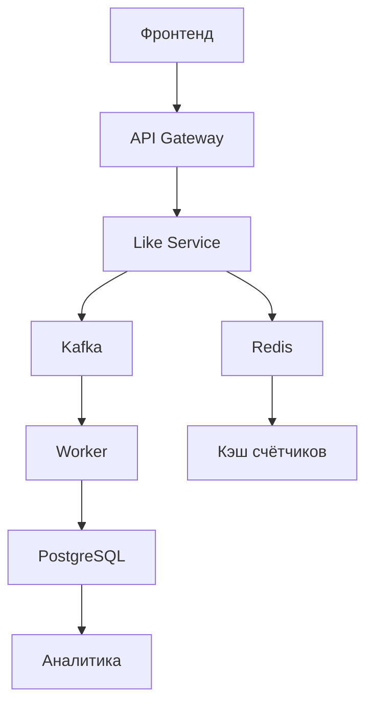

## Ответы на вопросы собеседования

## [Вакансия](https://voronezh.hh.ru/vacancy/131850689?hhtmFrom=chat)
https://voronezh.hh.ru/vacancy/131850689?hhtmFrom=chat

## [Список вопросов](https://docs.google.com/document/d/1oyrBHZoXt78VVsqd3vLDvxDpObKXIapYFCIpE29CUfo/edit?pli=1&tab=t.0)
https://docs.google.com/document/d/1oyrBHZoXt78VVsqd3vLDvxDpObKXIapYFCIpE29CUfo/edit?pli=1&tab=t.0

---

Здравствуйте. Ниже ответы на ваши вопросы.
Я глубоко уважаю вас как потенциального работодателя, но так же ценю своё время, поэтому говорю как есть: я применил нейросеть.
Разумеется, её ответы я перепроверил и для первой итерации я нахожу их релевантными, хотя по опыту скажу, что ИИ не работают с первого раза и требуется до 3-4-ёх уточнений прежде чем решение станет рабочим.
Тем не менее, на мой взгляд, это всё равно эффективнее, чем ошибаться человеку. Да, я использую ИИ в своей работе плотно уже 2+ года. Разумеется, не доверяю его ответам слепо, но нахожу его в высшей степени полезным инструментом.
Каждый момент я готов уточнить в личной беседе или, если всё сложится хорошо, на дейлике.
Спасибо.

Всеволод

[CV Head Hunter](https://voronezh.hh.ru/resume/6750c5ecff09d5137c0039ed1f7377696c6468)

[+7960 106 15 65](tel:+79601061565)

[@BorgSeva](https://t.me/BorgSeva)

---
## Вопрос 1

Вопрос связан с архитектурой построения таблиц БД и обвязки в виде Кеша. В ответе указать не просто схему организации, но объяснить ход мышления.
Дано: есть бизнес структура. Она состоит из товаров которые продаются в разных ГЕО. При этом в каждом ГЕО есть своя валюта и своя цена (учитывая доставку). К каждому ГЕО, на каждый товар приходят лиды, которых надо фиксировать. При этом есть коэффициент который динамически повышает или понижает цену в зависимости от количества лидов пришедших на ГЕО и товар. По принципу - больше лидов - меньше цена. Рейтинг обновляется раз в 10 минут.
Отразите схему организации мест хранения данных и взаимодействия с ними в виде запросов.


---

## Шаг 1. Анализ требований

Ключевые сущности и связи:
* **Товары** — базовый каталог.
* **ГЕО** — географические зоны продаж.
* **Валюты** — привязаны к ГЕО.
* **Цены** — зависят от товара и ГЕО, включают доставку.
* **Лиды** — фиксируются по ГЕО и товару.
* **Коэффициенты** — динамически корректируют цену на основе количества лидов.
* **Рейтинги** — пересчитываются каждые 10 минут.

Важные нюансы:
* Высокая частота обновления коэффициентов (каждые 10 минут).
* Большое количество операций записи лидов.
* Необходимость быстрого чтения актуальных цен для пользователей.

## Шаг 2. Схема базы данных

```sql
-- Товары
CREATE TABLE products (
    product_id BIGINT PRIMARY KEY,
    name VARCHAR(255) NOT NULL,
    description TEXT,
    created_at TIMESTAMP DEFAULT CURRENT_TIMESTAMP
);

-- ГЕО
CREATE TABLE geo_zones (
    geo_id BIGINT PRIMARY KEY,
    name VARCHAR(100) NOT NULL,
    currency_code CHAR(3) NOT NULL -- например, USD, EUR
);

-- Базовые цены (с учётом доставки)
CREATE TABLE base_prices (
    product_id BIGINT NOT NULL,
    geo_id BIGINT NOT NULL,
    base_price DECIMAL(15, 2) NOT NULL,
    PRIMARY KEY (product_id, geo_id),
    FOREIGN KEY (product_id) REFERENCES products(product_id),
    FOREIGN KEY (geo_id) REFERENCES geo_zones(geo_id)
);

-- Лиды
CREATE TABLE leads (
    lead_id BIGSERIAL PRIMARY KEY,
    product_id BIGINT NOT NULL,
    geo_id BIGINT NOT NULL,
    lead_timestamp TIMESTAMP DEFAULT CURRENT_TIMESTAMP,
    FOREIGN KEY (product_id) REFERENCES products(product_id),
    FOREIGN KEY (geo_id) REFERENCES geo_zones(geo_id)
);

-- Коэффициенты и итоговые цены (рассчитываются раз в 10 минут)
CREATE TABLE price_coefficients (
    product_id BIGINT NOT NULL,
    geo_id BIGINT NOT NULL,
    coefficient DECIMAL(5, 4) DEFAULT 1.0,
    calculated_at TIMESTAMP NOT NULL,
    final_price DECIMAL(15, 2) NOT NULL,
    PRIMARY KEY (product_id, geo_id),
    FOREIGN KEY (product_id) REFERENCES products(product_id),
    FOREIGN KEY (geo_id) REFERENCES geo_zones(geo_id)
);
```

## Шаг 3. Кеш‑слой

Используем Redis для:
* кэширования итоговых цен (ключ: `price:{product_id}:{geo_id}`);
* подсчёта текущих лидов в реальном времени (ключ: `leads_count:{product_id}:{geo_id}`).

**Стратегия кеширования:**
* **Write‑through** для базовых цен: запись в БД + обновление кеша.
* **Read‑through** для итоговых цен: если в кеше нет — берём из БД, кладем в кеш.
* **TTL** для итоговых цен — 9 минут (чтобы гарантировать пересчет каждые 10 минут).

## Шаг 4. Логика взаимодействия и запросы

### 1. Фиксация лида

**Действие:** пользователь оставляет заявку.

**Операции:**
1. Запись в таблицу `leads`.
2. Увеличение счётчика в Redis.

**Запросы:**
```sql
-- Запись лида в БД
INSERT INTO leads (product_id, geo_id) VALUES ($1, $2);
```
```bash
# Увеличение счётчика лидов в Redis
INCR leads_count:{$product_id}:{$geo_id}
```

### 2. Пересчёт коэффициентов (каждые 10 минут)

**Действие:** фоновый процесс пересчитывает коэффициенты и итоговые цены.

**Логика расчёта:**
* Чем больше лидов — тем ниже коэффициент (например, линейная зависимость: $\text{коэффициент} = \frac{1}{1 + k \cdot \text{количество лидов}}$, где $k$ — настраиваемый параметр).
* Итоговая цена: $\text{final\_price} = \text{base\_price} \times \text{coefficient}$.

**Запрос к БД (подсчёт лидов за последние 10 минут):**
```sql
SELECT product_id, geo_id, COUNT(*) AS lead_count
FROM leads
WHERE lead_timestamp >= NOW() - INTERVAL '10 minutes'
GROUP BY product_id, geo_id;
```

**Обновление коэффициентов и цен:**
```sql
INSERT INTO price_coefficients (product_id, geo_id, coefficient, calculated_at, final_price)
VALUES ($1, $2, $3, NOW(), $4)
ON CONFLICT (product_id, geo_id) DO UPDATE
SET coefficient = EXCLUDED.coefficient,
    calculated_at = EXCLUDED.calculated_at,
    final_price = EXCLUDED.final_price;
```

### 3. Получение цены для пользователя

**Действие:** показ цены на сайте/в приложении.

**Порядок операций:**
1. Проверка кеша Redis по ключу `price:{product_id}:{geo_id}`.
2. Если в кеше нет:
   * запрос к БД: `SELECT final_price FROM price_coefficients WHERE product_id = $1 AND geo_id = $2`;
   * запись результата в кеш с TTL = 9 минут.
3. Возврат цены пользователю.

**Пример запроса к Redis:**
```bash
GET price:{$product_id}:{$geo_id}
```

### 4. Обновление базовой цены

**Действие:** изменение базовой цены (например, из‑за изменения стоимости доставки).

**Операции:**
1. Обновление `base_prices`.
2. Запуск пересчёта коэффициентов (как в шаге 2).
3. Очистка соответствующего ключа в кеше Redis.

**Запрос:**
```sql
UPDATE base_prices
SET base_price = $3
WHERE product_id = $1 AND geo_id = $2;
```
```bash
DEL price:{$product_id}:{$geo_id}
```

---

## Шаг 5. Обобщённая схема взаимодействия

1. **Пользователь оставляет лид** → запись в `leads` + увеличение счётчика в Redis.
2. **Каждые 10 минут:**
   * подсчёт лидов за период;
   * расчёт коэффициентов;
   * обновление `price_coefficients`;
   * заполнение кеша Redis.
3. **Показ цены:** чтение из кеша (если есть) или из БД + запись в кеш.
4. **Изменение базовой цены:** обновление БД + очистка кеша + пересчёт коэффициентов.

## Преимущества решения

* **Производительность:** кеш Redis обеспечивает быстрое чтение цен.
* **Актуальность:** пересчёт каждые 10 минут гарантирует корректность коэффициентов.
* **Масштабируемость:** разделение на базовые цены и коэффициенты позволяет гибко настраивать логику.
* **Надёжность:** все данные сохраняются в реляционной БД, кеш — вторичный слой.

---

## Вопрос 2

Вопрос по организации кода.
Необходимо сделать сервис для лайк/дизлайк, который может быть интегрирован в разные места проекта, учитывающий что на разных страницах есть разные сущности для лайков. Количество экшнов за день равно от 1млн. Опишите с точки зрения технологии, языков и базовой структуры как вы организуете код и взаимодействие его частей друг с другом.

---

## Технологический стек

**Основные компоненты:**

* **Бэкенд:** Go (высокая производительность, хорошая поддержка конкурентности) или Java (Spring Boot) — для обработки миллионов запросов.
* **База данных:** Redis (кеширование и счётчики) + PostgreSQL (хранение истории действий).
* **Очередь сообщений:** Kafka или RabbitMQ — для асинхронной обработки и разгрузки основного сервиса.
* **API:** REST или gRPC — для взаимодействия с фронтендом и другими сервисами.
* **Контейнеризация:** Docker + Kubernetes — для масштабирования.
* **Мониторинг:** Prometheus + Grafana, ELK Stack для логирования.

## Архитектура системы

Система строится по микросервисной архитектуре:

1. **Сервис лайков (Like Service)** — основной сервис.
2. **Сервис аналитики** — сбор статистики.
3. **Сервис уведомлений** — отправка уведомлений о действиях пользователей.

## Базовая структура кода (на примере Go)

```
like-service/
├── cmd/
│   └── server/
│       └── main.go                  # Точка входа приложения
├── internal/
│   ├── config/                     # Конфигурация
│   ├── handler/                  # HTTP-обработчики
│   │   ├── like_handler.go
│   │   └── stats_handler.go
│   ├── model/                    # Модели данных
│   │   ├── like.go
│   │   └── entity.go
│   ├── repository/               # Работа с БД
│   │   ├── postgres/
│   │   │   └── like_repository.go
│   │   └── redis/
│   │       └── counter_repository.go
│   ├── service/                  # Бизнес-логика
│   │   ├── like_service.go
│   │   └── stats_service.go
│   └── util/                     # Вспомогательные утилиты
│       ├── validator.go
│       └── rate_limiter.go
├── pkg/                          # Публичные пакеты для интеграции
│   └── likeclient/             # Клиент для других сервисов
├── migrations/                 # Миграции БД
├── docker/                     # Docker-конфигурации
├── k8s/                        # Kubernetes манифесты
└── Makefile                    # Утилиты для сборки и запуска
```

## Модели данных

**PostgreSQL (основное хранилище):**

```sql
CREATE TABLE user_likes (
    id BIGSERIAL PRIMARY KEY,
    user_id BIGINT NOT NULL,
    entity_type VARCHAR(50) NOT NULL, -- post, comment, video, etc.
    entity_id BIGINT NOT NULL,
    is_like BOOLEAN NOT NULL,
    created_at TIMESTAMP WITH TIME ZONE DEFAULT NOW(),
    UNIQUE(user_id, entity_type, entity_id)
);

CREATE INDEX idx_user_likes_entity ON user_likes(entity_type, entity_id);
CREATE INDEX idx_user_likes_user ON user_likes(user_id);
```

**Redis (кеш и счётчики):**

* Счётчики лайков/дизлайков: `entity:{type}:{id}:likes`, `entity:{type}:{id}:dislikes`.
* Кеш последних действий пользователя: `user:{id}:recent_actions`.

## Взаимодействие компонентов

**Последовательность обработки запроса:**

1. Фронтенд отправляет запрос на эндпоинт `/api/like`.
2. API Gateway маршрутизирует запрос в Like Service.
3. Сервис проверяет лимиты и валидирует запрос.
4. Обновляет счётчики в Redis (атомарно).
5. Кладёт сообщение в Kafka о новом лайке.
6. Возвращает быстрый ответ пользователю.
7. Отдельный воркер обрабатывает сообщения из Kafka и сохраняет в PostgreSQL.

**Схема взаимодействия:**



## Ключевые механизмы для высокой нагрузки

**1. Кеширование в Redis:**
* Счётчики лайков/дизлайков хранятся в Redis.
* Периодическая синхронизация с PostgreSQL (например, каждые 5 минут или при достижении порога).

**2. Асинхронная обработка:**
* Все тяжёлые операции (запись в БД, аналитика, уведомления) выполняются асинхронно через Kafka.

**3. Rate limiting:**
* Ограничение количества действий пользователя (например, не более 1000 лайков в день).
* Реализация через Redis (счётчик с TTL).

**4. Партиционирование данных:**
* Данные в PostgreSQL партиционируются по `entity_type`.
* Индексы оптимизированы для быстрого поиска по типу сущности и ID.

**5. Горизонтальное масштабирование:**
* Несколько инстансов сервиса за балансировщиком нагрузки.
* Stateless архитектура для лёгкого масштабирования.

## API эндпоинты

**REST API:**

* `POST /api/v1/like` — поставить лайк/дизлайк.
  Тело запроса:
  ```json
  {
    "user_id": 123,
    "entity_type": "post",
    "entity_id": 456,
    "is_like": true
  }
  ```
* `GET /api/v1/like/stats/{type}/{id}` — получить статистику.
* `GET /api/v1/like/user/{user_id}` — история действий пользователя.

## Оптимизации для 1 млн+ запросов в день

**На уровне кода:**
* Использование пулов соединений с БД.
* Пакетная обработка записей в PostgreSQL.
* Оптимизированные SQL-запросы с индексами.

**На уровне инфраструктуры:**
* Redis Cluster для кеширования.
* PostgreSQL с репликами для чтения.
* Автоматическое масштабирование Kubernetes по нагрузке.
* CDN для статических данных.

## Мониторинг и отладка

**Метрики для отслеживания:**
* Количество запросов в секунду.
* Время ответа API.
* Ошибки базы данных.
* Задержки в Kafka.
* Использование памяти Redis.

**Логирование:**
* Детальные логи для отладки.
* Структурированные логи в формате JSON.
* Централизованный сбор логов через ELK.

---

## Альтернативные подходы

**Вариант 1: Полностью in‑memory решение**
* Использовать только Redis с персистентностью.
* Подходит, если не нужна детальная история действий.

**Вариант 2: Использование Cassandra**
* Для ещё большей масштабируемости.
* Лучшая поддержка распределённых систем.

**Вариант 3: Serverless архитектура**
* AWS Lambda + DynamoDB.
* Автоматическое масштабирование, но возможны проблемы с холодными стартами.

## Важные замечания

1. **Безопасность:**
   * Аутентификация и авторизация через JWT.
   * Валидация всех входящих данных.
   * Защита от CSRF и XSS.

2. **Тестирование:**
   * Unit‑тесты для бизнес‑логики.
   * Интеграционные тесты с реальными сервисами.
   * Нагрузочное тестирование перед запуском.

3. **Резервное копирование:**
   * Регулярные бэкапы PostgreSQL.
   * Snapshot Redis.

---

## Вопрос 3

Вопрос по логике
У вас есть хранимые изображения на жестком диске. их количество более 1млн, при этом вес каждой от 10 до 50 мб. Изображения постоянно дополняются. До этого момента они не были никак каталогизированны. В настоящий момент надо организовать, при каждом новом пополнении выполняется определение похожих картинок и пометка данной категории.
Как вы технически будете это организовывать?

---

Разберу задачу пошагово и предложу техническое решение.

## Этап 1. Выбор метода сравнения изображений

Для поиска похожих изображений оптимально использовать **визуальные дескрипторы (фичи)** вместо прямого сравнения пикселей. Варианты:

1. **Perceptual хеши (pHash)** — быстрый, но менее точный.
2. **SIFT/SURF** — устойчивые к поворотам/масштабу, но медленные.
3. **Нейросети-энкодеры** (ResNet, EfficientNet) — лучший баланс точности и скорости.
4. **Векторные эмбеддинги** — современные модели дают компактное представление.

**Рекомендация:** использовать предобученную CNN (например, EfficientNet-B0) для получения векторных представлений изображений размером $512–2048$ измерений.

## Этап 2. Архитектура системы

Схема работы:

```
Новое изображение → Извлечение фич → Поиск соседей → Пометка → Сохранение
```

### Компоненты системы

1. **Сервис приёма изображений** (REST API или файловая система).
2. **Экстрактор фич** — нейросеть для получения вектора признаков.
3. **База векторов** — специализированная БД для векторного поиска.
4. **Сервис поиска дубликатов** — выполняет поиск ближайших соседей.
5. **Хранилище изображений** — файловая система/S3‑совместимое хранилище.
6. **Метаданные** — реляционная БД (PostgreSQL) или документоориентированная (MongoDB).

## Этап 3. Выбор хранилища векторов

Для 1 млн+ векторов нужны специализированные решения:

* **FAISS** (Facebook) — оптимизирован для быстрого поиска ближайших соседей, поддерживает GPU.
* **Annoy** (Spotify) — простой в использовании, хорошая производительность.
* **Weaviate** / **Pinecone** — облачные векторные БД.
* **Elasticsearch** с векторными полями.
* **PostgreSQL** + расширение **pgvector**.

**Рекомендация:** начать с **FAISS**, затем при росте нагрузки рассмотреть **Weaviate** или **Pinecone**.

## Этап 4. Алгоритм обработки нового изображения

1. При загрузке нового изображения:
   * сохраняем файл в хранилище (S3/локальная ФС);
   * извлекаем вектор признаков через нейросеть:
     * нормализуем изображение ($224 \times 224$ px);
     * пропускаем через предобученную сеть;
     * получаем вектор $V_{new}$ размерности $D$.
2. Ищем ближайшие соседи в векторной БД:
   * используем **ANN** (Approximate Nearest Neighbors) поиск;
   * задаём порог схожести (например, косинусное расстояние $> 0{,}9$).
3. Если найдены похожие изображения:
   * добавляем связь в метаданные;
   * помечаем как «похожее на ID_XXX».
4. Добавляем новый вектор в векторную БД.
5. Сохраняем метаданные (путь, хеш, связи, вектор ID).

## Этап 5. Техническая реализация

### Стеки технологий

* **Язык:** Python (PyTorch/TensorFlow для нейросетей).
* **Векторная БД:** FAISS + PostgreSQL (метаданные).
* **Хранение файлов:** локальная ФС или S3‑совместимое хранилище.
* **Очереди:** Redis/RabbitMQ для асинхронной обработки.
* **API:** FastAPI/Flask.
* **Контейнеризация:** Docker + Kubernetes (при масштабировании).

### Псевдокод обработки

```python
def process_new_image(image_path):
    # 1. Сохраняем изображение
    file_id = save_to_storage(image_path)

    # 2. Извлекаем вектор признаков
    vector = extract_features(image_path)  # shape: (1, 512)

    # 3. Ищем похожие в FAISS
    similar_ids, distances = faiss_index.search(vector, k=10)

    # 4. Фильтруем по порогу
    threshold = 0.9
    similar = [
        (id, dist) for id, dist in zip(similar_ids[0], distances[0])
        if dist > threshold
    ]

    # 5. Сохраняем связи
    if similar:
        for sim_id, sim_dist in similar:
            link_images(file_id, sim_id, sim_dist)

    # 6. Добавляем вектор в индекс
    faiss_index.add(vector)

    # 7. Сохраняем метаданные
    save_metadata(file_id, vector, similar)
```

## Этап 6. Оптимизация и масштабирование

1. **Асинхронная обработка:**
   * ставим изображения в очередь (Redis);
   * обрабатываем фоновыми воркерами.
2. **Пакетная обработка:**
   * обновляем индекс FAISS раз в N часов или при достижении порога (1000 новых векторов).
3. **Кэширование:**
   * кэшируем часто запрашиваемые результаты (Redis).
4. **Горизонтальное масштабирование:**
   * шардирование векторной БД;
   * балансировка нагрузки на API.
5. **Оптимизация нейросетей:**
   * квантование модели;
   * использование ONNX Runtime для ускорения.

## Этап 7. Мониторинг и поддержка

* логирование ошибок и метрик (время обработки, точность);
* алертинг при падении сервиса;
* периодическая проверка целостности индекса;
* аудит дубликатов (ручная проверка случайных выборок).

---

## Итоговая архитектура

1. **Frontend:** API для загрузки изображений.
2. **Backend:**
   * очередь задач (Redis);
   * воркеры обработки (Python + PyTorch);
   * векторная БД (FAISS);
   * метаданные (PostgreSQL).
3. **Storage:** S3‑хранилище для изображений.
4. **Monitoring:** Prometheus + Grafana.

## Плюсы подхода

* **Масштабируемость:** легко добавить шардирование.
* **Скорость:** ANN‑поиск за миллисекунды.
* **Точность:** нейросети лучше классических методов.
* **Гибкость:** можно менять модель эмбеддингов.

## Возможные проблемы и решения

| Проблема | Решение |
|--------|---------|
| Рост индекса FAISS | Периодическая перестройка или шардирование |
| Ложные срабатывания | Настройка порога схожести, ансамбли моделей |
| Падение производительности | Кэширование, GPU‑ускорение |
| Дублирование векторов | Проверка по хешу перед обработкой |

---
