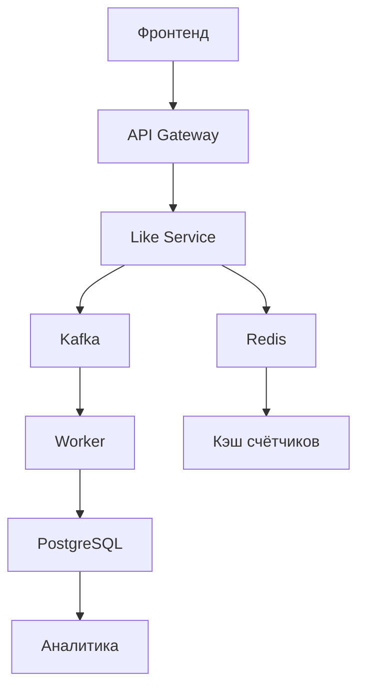

## Вопрос 2

Вопрос по организации кода.
Необходимо сделать сервис для лайк/дизлайк, который может быть интегрирован в разные места проекта, учитывающий что на разных страницах есть разные сущности для лайков. Количество экшнов за день равно от 1млн. Опишите с точки зрения технологии, языков и базовой структуры как вы организуете код и взаимодействие его частей друг с другом.

---

Разберу задачу по частям — от архитектуры до деталей реализации.

## Технологический стек

**Основные компоненты:**

* **Бэкенд:** Go (высокая производительность, хорошая поддержка конкурентности) или Java (Spring Boot) — для обработки миллионов запросов.
* **База данных:** Redis (кеширование и счётчики) + PostgreSQL (хранение истории действий).
* **Очередь сообщений:** Kafka или RabbitMQ — для асинхронной обработки и разгрузки основного сервиса.
* **API:** REST или gRPC — для взаимодействия с фронтендом и другими сервисами.
* **Контейнеризация:** Docker + Kubernetes — для масштабирования.
* **Мониторинг:** Prometheus + Grafana, ELK Stack для логирования.

## Архитектура системы

Система строится по микросервисной архитектуре:

1. **Сервис лайков (Like Service)** — основной сервис.
2. **Сервис аналитики** — сбор статистики.
3. **Сервис уведомлений** — отправка уведомлений о действиях пользователей.

## Базовая структура кода (на примере Go)

```
like-service/
├── cmd/
│   └── server/
│       └── main.go                  # Точка входа приложения
├── internal/
│   ├── config/                     # Конфигурация
│   ├── handler/                  # HTTP-обработчики
│   │   ├── like_handler.go
│   │   └── stats_handler.go
│   ├── model/                    # Модели данных
│   │   ├── like.go
│   │   └── entity.go
│   ├── repository/               # Работа с БД
│   │   ├── postgres/
│   │   │   └── like_repository.go
│   │   └── redis/
│   │       └── counter_repository.go
│   ├── service/                  # Бизнес-логика
│   │   ├── like_service.go
│   │   └── stats_service.go
│   └── util/                     # Вспомогательные утилиты
│       ├── validator.go
│       └── rate_limiter.go
├── pkg/                          # Публичные пакеты для интеграции
│   └── likeclient/             # Клиент для других сервисов
├── migrations/                 # Миграции БД
├── docker/                     # Docker-конфигурации
├── k8s/                        # Kubernetes манифесты
└── Makefile                    # Утилиты для сборки и запуска
```

## Модели данных

**PostgreSQL (основное хранилище):**

```sql
CREATE TABLE user_likes (
    id BIGSERIAL PRIMARY KEY,
    user_id BIGINT NOT NULL,
    entity_type VARCHAR(50) NOT NULL, -- post, comment, video, etc.
    entity_id BIGINT NOT NULL,
    is_like BOOLEAN NOT NULL,
    created_at TIMESTAMP WITH TIME ZONE DEFAULT NOW(),
    UNIQUE(user_id, entity_type, entity_id)
);

CREATE INDEX idx_user_likes_entity ON user_likes(entity_type, entity_id);
CREATE INDEX idx_user_likes_user ON user_likes(user_id);
```

**Redis (кеш и счётчики):**

* Счётчики лайков/дизлайков: `entity:{type}:{id}:likes`, `entity:{type}:{id}:dislikes`.
* Кеш последних действий пользователя: `user:{id}:recent_actions`.

## Взаимодействие компонентов

**Последовательность обработки запроса:**

1. Фронтенд отправляет запрос на эндпоинт `/api/like`.
2. API Gateway маршрутизирует запрос в Like Service.
3. Сервис проверяет лимиты и валидирует запрос.
4. Обновляет счётчики в Redis (атомарно).
5. Кладёт сообщение в Kafka о новом лайке.
6. Возвращает быстрый ответ пользователю.
7. Отдельный воркер обрабатывает сообщения из Kafka и сохраняет в PostgreSQL.

**Схема взаимодействия:**



## Ключевые механизмы для высокой нагрузки

**1. Кеширование в Redis:**
* Счётчики лайков/дизлайков хранятся в Redis.
* Периодическая синхронизация с PostgreSQL (например, каждые 5 минут или при достижении порога).

**2. Асинхронная обработка:**
* Все тяжёлые операции (запись в БД, аналитика, уведомления) выполняются асинхронно через Kafka.

**3. Rate limiting:**
* Ограничение количества действий пользователя (например, не более 1000 лайков в день).
* Реализация через Redis (счётчик с TTL).

**4. Партиционирование данных:**
* Данные в PostgreSQL партиционируются по `entity_type`.
* Индексы оптимизированы для быстрого поиска по типу сущности и ID.

**5. Горизонтальное масштабирование:**
* Несколько инстансов сервиса за балансировщиком нагрузки.
* Stateless архитектура для лёгкого масштабирования.

## API эндпоинты

**REST API:**

* `POST /api/v1/like` — поставить лайк/дизлайк.
  Тело запроса:
  ```json
  {
    "user_id": 123,
    "entity_type": "post",
    "entity_id": 456,
    "is_like": true
  }
  ```
* `GET /api/v1/like/stats/{type}/{id}` — получить статистику.
* `GET /api/v1/like/user/{user_id}` — история действий пользователя.

## Оптимизации для 1 млн+ запросов в день

**На уровне кода:**
* Использование пулов соединений с БД.
* Пакетная обработка записей в PostgreSQL.
* Оптимизированные SQL-запросы с индексами.

**На уровне инфраструктуры:**
* Redis Cluster для кеширования.
* PostgreSQL с репликами для чтения.
* Автоматическое масштабирование Kubernetes по нагрузке.
* CDN для статических данных.

## Мониторинг и отладка

**Метрики для отслеживания:**
* Количество запросов в секунду.
* Время ответа API.
* Ошибки базы данных.
* Задержки в Kafka.
* Использование памяти Redis.

**Логирование:**
* Детальные логи для отладки.
* Структурированные логи в формате JSON.
* Централизованный сбор логов через ELK.

---

## Альтернативные подходы

**Вариант 1: Полностью in‑memory решение**
* Использовать только Redis с персистентностью.
* Подходит, если не нужна детальная история действий.

**Вариант 2: Использование Cassandra**
* Для ещё большей масштабируемости.
* Лучшая поддержка распределённых систем.

**Вариант 3: Serverless архитектура**
* AWS Lambda + DynamoDB.
* Автоматическое масштабирование, но возможны проблемы с холодными стартами.

## Важные замечания

1. **Безопасность:**
   * Аутентификация и авторизация через JWT.
   * Валидация всех входящих данных.
   * Защита от CSRF и XSS.

2. **Тестирование:**
   * Unit‑тесты для бизнес‑логики.
   * Интеграционные тесты с реальными сервисами.
   * Нагрузочное тестирование перед запуском.

3. **Резервное копирование:**
   * Регулярные бэкапы PostgreSQL.
   * Snapshot Redis.

---